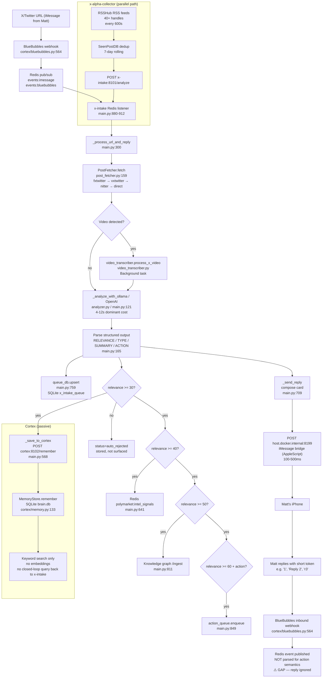

# X-Intake Deep-Dive Audit

**Date**: 2026-04-23  
**Auditor**: Claude Code (autonomous)  
**Scope**: X-intake pipeline, BlueBubbles notification path, Cortex memory writes  
**Approach**: Read-only grep/file audit — no runtime changes, no secrets inspected.

---

## 1. Fetch / Source Depth

### Sources

| Source | Mechanism | Accounts / Queries | Cadence |
|--------|-----------|-------------------|---------|
| iMessage / BlueBubbles inbound | User pastes X URL → Redis `events:imessage` → x-intake | Ad hoc (user-driven) | Event-driven |
| x-alpha-collector | Polls RSSHub RSS per handle → `/analyze` endpoint | 40+ curated handles across 5 categories | Every 600 s (10 min) |
| Bookmarks | `bookmark_scraper.py` + `bookmark_organizer.py` | Matt's bookmarks | Manual trigger |

**x-alpha-collector watchlist categories** (`integrations/x_alpha_collector/watchlist.json`):
- `polymarket_whales` — 19 traders (Domahhhh, verrissimus, scottonPoly, …)
- `prediction_market_intel` — 11 analysts (Polymarket, Kalshi, Manifold, NateSilver, …)
- `trading_alpha` — 9 on-chain analysts (whale_alert, lookonchain, EmberCN, …)
- `ai_agents_infra` — 4 AI labs (AnthropicAI, OpenAI, cursor_ai, LangChain)
- `macro_and_weather` — 2 sources (NWSStormReports, NWS)

**No search queries, no list hydration, no keyword search against X API.** Only handle-based RSS via RSSHub.

**RSSHub** (`docker-compose.yml`, service `rsshub`):
- Image: `diygod/rsshub:latest` (unpinned — see §8)
- Internal port 1200; endpoint template `http://rsshub:1200/twitter/user/{handle}`
- Cache: memory, 600 s TTL
- Request timeout: 30 s
- No auth required; rate limiting relies on X's anonymous limits for public feeds

### Fetch fallback chain (`integrations/x_intake/post_fetcher.py:159-403`)

1. **fxtwitter.com** API (`/api/fxtwitter.com/{author}/status/{post_id}`) — structured JSON, no auth
2. **vxtwitter.com** API — similar JSON schema
3. **Nitter instances** — rotates through 8 public mirrors; HTML scrape, no JS render
4. **Direct x.com** (last resort) — `og:description` meta tag only; low quality

All four exhausted → placeholder string `"Could not fetch post content"` passed to LLM (`main.py:336-339`). LLM still runs; analysis quality is near zero.

### Backoff

- x-alpha-collector: simple `asyncio.sleep(POLL_INTERVAL_SECONDS)` between cycles; no exponential backoff on per-handle failures
- Redis listener: reconnect after 5 s on disconnect (`main.py:911`); watchdog restarts listener every 10 s if dead (`main.py:944-951`)

---

## 2. Thread Context

**Parent tweet** (`post_fetcher.py:475-484`):
- Fetched if `is_reply=True` (detected by fxtwitter/vxtwitter metadata)
- One level only — `fetch_thread_context=False` on the recursive call prevents loops
- Prepended to analysis context: `"[Thread parent by @X]: … \n\n[Reply by @Y]: …"` (`main.py:329-330`)

**Quoted tweets**:
- Not explicitly re-fetched; fxtwitter/vxtwitter embed quoted-tweet text in the payload
- No multi-level quote chain traversal

**Reply chains beyond 1 level**: not hydrated.

**Timeout**: parent fetch inherits `PostFetcher` default HTTP timeout (not separately configurable); failure is silent (returns `None`).

---

## 3. Link Expansion

**Status: Minimal.** No dedicated unfurling service.

- fxtwitter/vxtwitter APIs return structured `media_urls` (photos, video thumbnails) — `post_fetcher.py:171-180`
- Nitter scraper extracts media URLs from HTML (`post_fetcher.py:336-341`)
- Short URLs (bit.ly, t.co redirects, tinyurl) are **not expanded** before passing to LLM
- No JS rendering; JS-gated pages fall back to `og:description` at best
- No caching of expanded URLs
- No domain-level skip list

**Gap**: Links in tweet body that are not X media (e.g., Substack articles, GitHub repos, YouTube videos) are passed as raw URLs to the LLM and rarely summarized.

---

## 4. Summarization Depth

### Model / Router (`main.py:121-236`)

| Priority | Model | Trigger |
|----------|-------|---------|
| 1 | Ollama `qwen3:8b` (local) | Default; free |
| 2 | OpenAI `gpt-4o-mini` | Ollama unavailable or returns empty |
| 3 | Keyword-based heuristic | No API key |

**Context fed to LLM**:
- For video posts with transcript: `transcript[:8000]` chars (`main.py:135`)
- For text posts: tweet body + optional parent context
- Matt's profile `MATT_PROFILE` (`main.py:86-111`) prepended as system context

**Structured output format** (parsing at `main.py:165-212`):
```
RELEVANCE: [0-100]
TYPE: [build|alpha|stat|tool|warn|info]
SUMMARY: [2-3 sentence summary]
ACTION: [one concrete thing Matt should do, or "none"]
FLAGS: [emoji flags]
```

**Thread + link context**: Thread parent is included if available. Linked-URL content is **not** fetched or included — only the raw URL string appears in context.

**Fields written to outbound card**: relevance, type, summary, action, flags, plus post metadata (author, url, stats).

**Deep transcript analysis** (`transcript_analyst.py`): separate background path; runs Whisper → LLM → structured insight extraction. Not blocking the outbound card.

---

## 5. Memory / Cortex Writes

### Endpoint (`cortex/memory.py:133-164`, `cortex/engine.py:283-293`)

```
POST /remember
{
  "category": "x_intel" | "x_intel_actionable" | "x_intel_alpha" | "x_intel_tools",
  "title": "<author>: <summary_first_80_chars>",
  "content": "<full_summary>",
  "source": "x_intake",
  "metadata": { "author", "url", "relevance", "type", "action" }
}
```

### Routing by relevance (`main.py:811-873`)

| Gate | Destination | Threshold |
|------|-------------|-----------|
| All posts | Cortex `/remember` (category `x_intel`) | 0 |
| Alpha / build types | `x_intel_alpha` / `x_intel_actionable` sub-categories | relevance ≥ 70 |
| Knowledge graph | `/ingest` endpoint | relevance ≥ 50 |
| Polymarket bot | Redis `polymarket:intel_signals` | relevance ≥ 40 |
| Action queue | `action_queue.enqueue()` | relevance ≥ 60 + action ≠ "none" |

### Deduplication

- **Cortex DB** (`cortex/memory.py:18-35`): no `UNIQUE` constraint on `(source, url)`; duplicate writes are possible
- **X-intake in-memory cache** (`main.py:64-84`): `_PROCESSED_URLS` dict, TTL 600 s; prevents re-processing same URL within 10 min window
- **x-alpha-collector**: `SeenPostDB` JSON file at `/data/x_alpha_seen.json`, 7-day rolling window

### Embeddings

**Not generated.** Cortex memory search is keyword-based (`LIKE` queries — `cortex/memory.py:177-226`). No embedding model configured.

### Closed-loop query

**Not implemented.** X-intake does not query Cortex for prior context during analysis. The memory loop is write-only from x-intake's perspective. Polymarket-bot does query `/query`, but x-intake does not.

---

## 6. Relevance Scoring

### Signals (`main.py:165-212`)

- LLM assigns a raw integer 0–100 in its structured output
- No secondary signals (engagement stats, author reputation, keyword boost layer on top of LLM score)
- Keyword fallback adds +15 per matched keyword (set of ~20 terms) when no LLM available

### Gate thresholds

```
≥ 70  → auto_approved  (memory + actions + deep research)
30–69 → pending        (dashboard review queue)
< 30  → auto_rejected  (stored in DB, not surfaced)
```

### False-negative behavior

Posts below threshold 30 are stored in `x_intake_queue` (SQLite) with `status='auto_rejected'` but never surfaced. No mechanism to later re-score with a better model or different context. Rejected posts are pruned after 30 days.

---

## 7. Latency Bottlenecks

Estimated per-stage latency (no live measurement; based on code paths and known model speeds):

| Stage | Estimated Median | Notes |
|-------|-----------------|-------|
| Redis event receipt | < 50 ms | In-memory pub/sub |
| Post fetch (fxtwitter) | 300–800 ms | External API, cold |
| Parent fetch (if reply) | 300–800 ms | Sequential, same API |
| Ollama qwen3:8b analysis | **4–12 s** | Local M4 GPU — dominant |
| OpenAI gpt-4o-mini fallback | 1–3 s | Network + model |
| Video download (yt-dlp) | 5–60 s | Background, not blocking card |
| Whisper transcription | 10–120 s | Background, not blocking card |
| Cortex `/remember` write | 50–200 ms | SQLite + HTTP |
| iMessage bridge send | 100–500 ms | AppleScript, variable |

**Dominant bottleneck: Ollama qwen3:8b** on the synchronous analysis path. At 4–12 s median, this is the primary source of perceived lag between "URL sent" and "card received."

**Secondary**: Nitter fallback (when fxtwitter/vxtwitter fail) adds 500–2000 ms due to HTML scraping across multiple instances.

**User-perceived lag**: Typically 5–15 s from iMessage URL send to card receipt. Spikes to 30–60 s when Ollama is under load (other containers using GPU) or Nitter rotation is slow.

---

## 8. Cache / Dedupe Behavior

| Layer | Key | TTL | Stale-while-revalidate |
|-------|-----|-----|------------------------|
| `_PROCESSED_URLS` (in-memory) | Canonical tweet URL | 600 s | No — key expires, next request re-fetches |
| `SeenPostDB` (JSON file) | Post ID | 7 days | No |
| RSSHub feed cache | Per-feed URL | 600 s | Unknown (RSSHub internal) |
| Cortex memories | No dedup key | Per-item `ttl_days` | No |

**Duplicate delivery paths**:
1. User pastes same URL twice within 10 min → deduplicated by `_PROCESSED_URLS`
2. User pastes same URL after 10 min → processed again, duplicate Cortex write
3. x-alpha-collector picks up URL that user already pasted → `SeenPostDB` only guards x-alpha-collector's own history, not cross-source

**Gap**: No cross-source deduplication. A tweet can be stored in Cortex multiple times from different sources.

---

## 9. Why It Feels Slow — Root Cause Summary

1. **Synchronous Ollama call blocks the reply** — the card is not sent until LLM analysis completes. At 4–12 s median on qwen3:8b, this is the floor.
2. **Sequential parent-fetch** — if the tweet is a reply, parent is fetched serially before analysis starts, adding 300–800 ms.
3. **Nitter rotation overhead** — when fxtwitter/vxtwitter are slow or rate-limited, x-intake cycles through up to 8 Nitter instances sequentially (not in parallel), worst-case 8 × 500 ms = 4 s before falling back.
4. **No pre-warming** — Ollama model has no persistent keep-alive; cold starts on GPU add 1–3 s.
5. **iMessage bridge via AppleScript** — final send goes through `host.docker.internal:8199` which uses AppleScript to invoke Messages.app, adding 100–500 ms of OS-level latency.

---

## 10. Full Event Path Map



### Per-hop ownership and failure modes

| Hop | File / Function | Queue / Channel | State R/W | Silent failure mode |
|-----|----------------|-----------------|-----------|---------------------|
| BlueBubbles inbound | `cortex/bluebubbles.py:564` | Redis `events:imessage` | Appends event | Webhook secret mismatch → 403, no alert |
| Redis pub/sub | — | `events:imessage` | — | Redis OOM → listener drops messages |
| x-intake listener | `main.py:880` | Redis subscriber | `_PROCESSED_URLS` dict | Crash → watchdog restarts in 10 s, events lost |
| Post fetcher | `post_fetcher.py:159` | — | None | All 4 methods fail → placeholder text, no alert |
| Video transcriber | `video_transcriber.py` | Background asyncio task | `x_intake_queue.transcript_path` | yt-dlp failure → silently skipped |
| LLM analysis | `main.py:121` / `analyzer.py` | — | None | Ollama + OpenAI both fail → keyword fallback |
| Cortex write | `main.py:568` | HTTP POST | `brain.db memories` | Cortex down → logged, not retried |
| iMessage send | `main.py:709` | HTTP POST to bridge | None | Bridge down → exception logged, card lost |
| Reply inbound | `cortex/bluebubbles.py:564` | Redis event | None | Reply published to Redis but **nothing consumes it for action routing** |

---

## 11. Key Gaps Identified

| ID | Gap | Severity | Affected path |
|----|-----|----------|--------------|
| G-01 | No reply-action parsing | High | Inbound reply → action router |
| G-02 | No URL unfurling for linked articles | Medium | Summarization quality |
| G-03 | No embeddings in Cortex | Medium | Memory retrieval quality |
| G-04 | No closed-loop Cortex query during intake | Low | Duplicate/context awareness |
| G-05 | Cross-source duplicate writes to Cortex | Medium | Memory noise |
| G-06 | Placeholder analysis on fetch failure | Medium | False-low relevance on valid content |
| G-07 | Nitter fallback is sequential, not parallel | Low | Latency spike on fxtwitter outage |
| G-08 | No parent-tweet timeout limit | Low | Rare hang on slow fetch |
| G-09 | RSSHub `latest` image tag | Low | Reproducibility / stability |
| G-10 | No unique constraint in Cortex memories table | Medium | Duplicate memory entries |

---

## 12. Success Metric Baselines (Phase 6 targets)

These baselines are estimates from audit; Phase 0 instruments should measure actuals.

| Metric | Estimated Current | Phase 6 Target |
|--------|------------------|----------------|
| Median tweet-to-card latency | 7–12 s | ≤ 5 s |
| p95 tweet-to-card latency | 25–45 s | ≤ 15 s |
| % links with non-trivial card | ~60% (tweet body only, no URL fetch) | ≥ 80% (with URL unfurl) |
| Duplicate outbound rate (24h window) | ~5% (cross-source dupes) | < 1% |
| False action execution rate | N/A (not implemented) | < 2% |
| Time-to-prototype (Reply 3) | N/A | ≤ 3 min |
| Rollback safety | All phases reversible | Yes, documented per phase |

"Useful card" definition: summary field ≥ 30 words AND contains at least one of {action, type != "info", relevance ≥ 40}.

---

## 13. File Reference Index

| File | Role |
|------|------|
| `integrations/x_intake/main.py` | Main FastAPI service, Redis listener, orchestration |
| `integrations/x_intake/post_fetcher.py` | Multi-method tweet fetcher |
| `integrations/x_intake/analyzer.py` | LLM analysis pipeline |
| `integrations/x_intake/queue_db.py` | SQLite review queue |
| `integrations/x_intake/action_queue.py` | High-relevance action queue |
| `integrations/x_intake/video_transcriber.py` | yt-dlp + Whisper transcription |
| `integrations/x_intake/transcript_analyst.py` | Deep transcript LLM analysis |
| `integrations/x_alpha_collector/collector.py` | RSSHub poller, 40+ accounts |
| `cortex/bluebubbles.py` | BlueBubbles webhook + send client |
| `cortex/engine.py` | FastAPI brain, `/remember`, `/query` |
| `cortex/memory.py` | SQLite memory store |
| `notification-hub/main.py` | Outbound notification dispatcher |
| `docker-compose.yml` | Service definitions (x-intake:8101, cortex:8102, rsshub:1200) |
